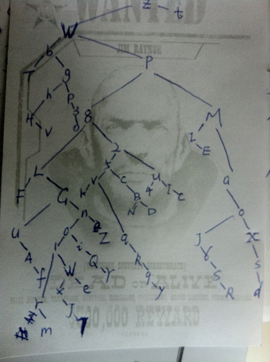

The Solutions for fun.coolshell.cn Puzzles
================

[Official Solutions](http://coolshell.cn/articles/11847.html)(中文)

This solution is not official.

**Level-0 Fuck your brain:**
<br/>It is a block of brainfuck programming language.
<br/>Find a brainfuck interpreter online, copy and paste the code, you will get the answer.
<br/>For more info about brainfuck, please view the [wikipedia](http://en.wikipedia.org/wiki/Brainfuck) or [Learn X in Y minutes](http://learnxinyminutes.com/)

**Level-1 Multiply:**
<br/>Find the next number in the sequence and multiple with the 'real' life number.
<br/>Use google we could get everything.
<br/>The answer is 42 × 1944.

**Level-2 Keyboard:**
<br/>It is Dvorak keyboard. The text is blinded typed by a QWERT user on the Dvorak keyboard. Translate it. You will get the following:
```
main(){
printf(&unix["\021%six\012\0"],(unix)["have"]+"fun"-0x60);
}
```
Run the code [online](http://www.compileonline.com/compile_c_online.php), you will get the answer.

**Level-3 QR Code:**
<br/>Using the QR code to get the cipher. 
<br/>Decrypt text is the following:
<br/>"Where there is a shell, there is a way. I expect you use the shell command to solve this problem, now, please try using the rot13 op "shell" to enter next level"

**Level-4 cat:**
<br/>The author have already shown you the pattern, then use the regex to locate them in source.
<br/>I used a lazy way: 
<br/>`/([A-Z]\d[a-z]\d[A-Z])|(\d[A-Z][a-z][A-Z]\d)/g`
<br/>It lists all the strings follows the regex, and you have to manually identify the palindrome ones. Luckily, there is not so many such strings.
<br/>Use an online regex interpreter is a good choice. I used the [regexr.com](http://www.regexr.com/).

**Level-5 variables:**
<br/>Follow the hint, you will eventually get the answer. (Write a program, it will save your time.)
<br/>My program is written in Python 3+, and you could view it in [level_5.py](level_5.py) file.

**Level-6 tree:**
<br/>Based on the in-order and pre-order sequence, rebuilt the binary tree.

<br/>From my handmade tree, we could see the deepest path is "zWp8LGn01wxJ7".
<br/>Run the following command in a shell, you will get the answer:
<br/>`echo 'U2FsdGVkX1+gxunKbemS2193vhGGQ1Y8pc5gPegMAcg=' | openssl enc -aes-128-cbc -a -d -pass pass:zWp8LGn01wxJ7`

(I created the tree manually, which supposes to write a program -_-|||)

**Level-7 N Queens:**
<br/>Find all the 9 queen solution, and fit into the $code to get the right one.
<br/>I borrowed the code from [Rosetta Code](http://rosettacode.org/wiki/N-queens_problem#Python) to generate the 9-Queens solutions (listed in 9_queen_solutions.txt).
<br/>Then calculate the sha1 to find the matched solution.
<br/>My code is in [level_7.py](level_7.py), and the n-Queens solution generator is in [n_queen.py](n_queen.py) .

**Level-8 Excel Column:**
<br/>It likes the binary number, octal number, and hexadecimal number. If you know how to transform between them, this question will be easy. (Don't forget to transform the number back to letters)
<br/>The equation could be tralated into following:
```
(C*26^8+O*26^6+O*26^5+L*26^5+S*26^4+H*26^3+E*26^2+L*26+L)
---------------------------------------------------------
(S*26^4+H*26^3+E*26^2+L*26+L)
```
<br/>Calculate it with calculator or program or whatever you want.
<br/>We get 85165, and we turn it back to letters. If you don't know the covert rules, please view this [link](http://www.cstutoringcenter.com/tutorials/general/convert.php).

**Level-9 Fraternal Organisation:**
<br/>It's pigpen and Freemasonry. Use Google wisely.
<br/>Put the term pigpen and Freemasonry in google, you will get the Pigpen cipher. 


<br/>An example of Pigpen message is following:


<br/>Then decrpt the message and get the reward.

**Enjoy!**

All level links are listed [here](all_Level_Links.md)
